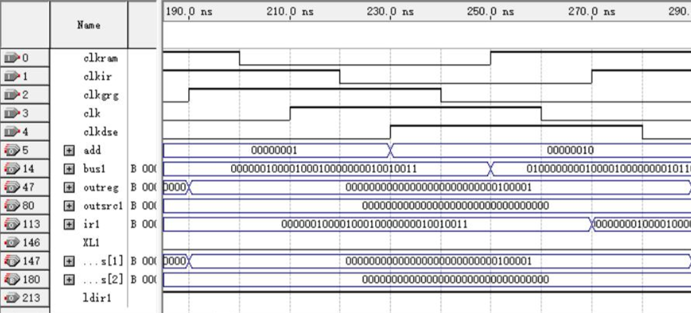
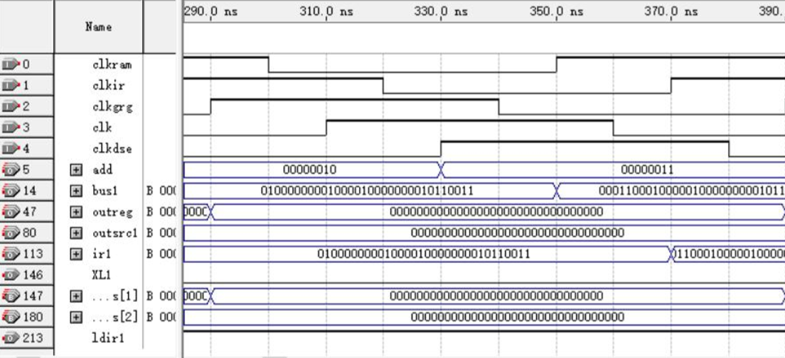
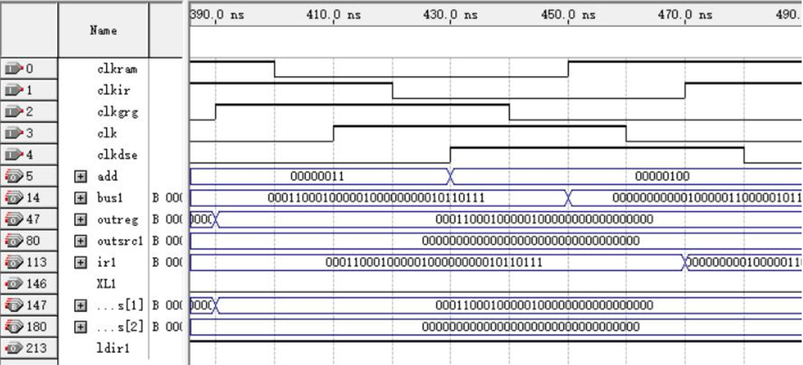
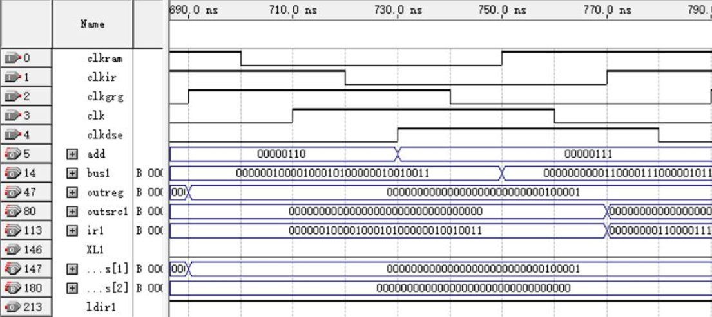
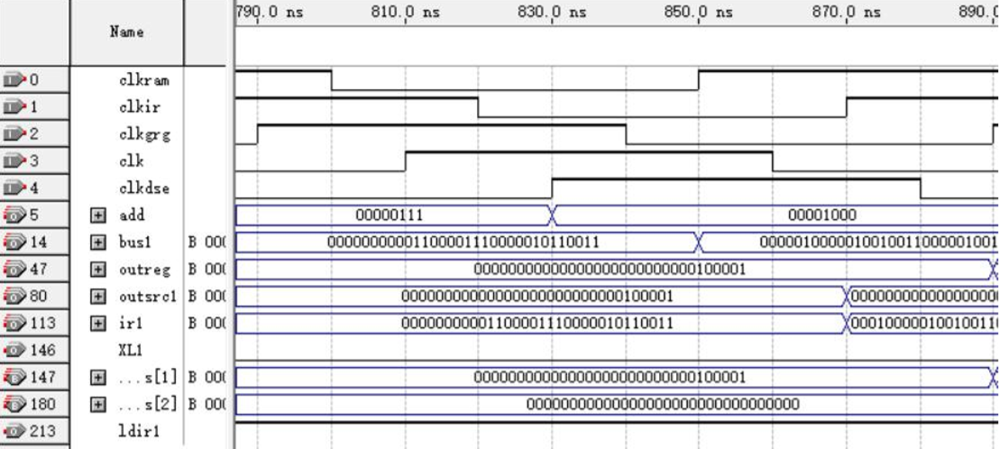
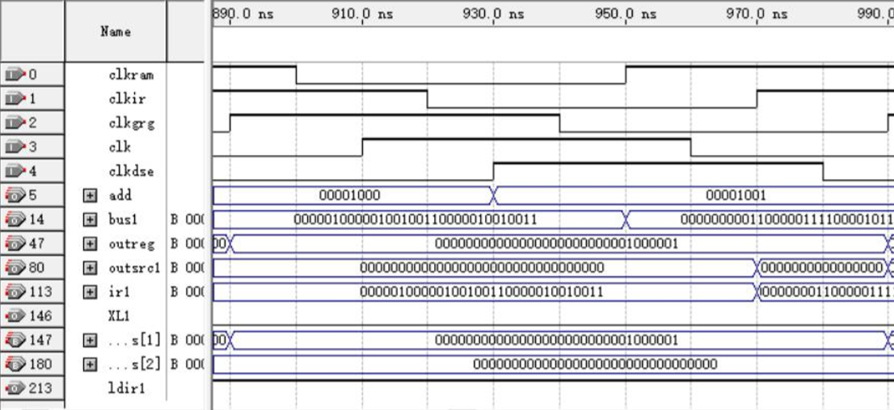
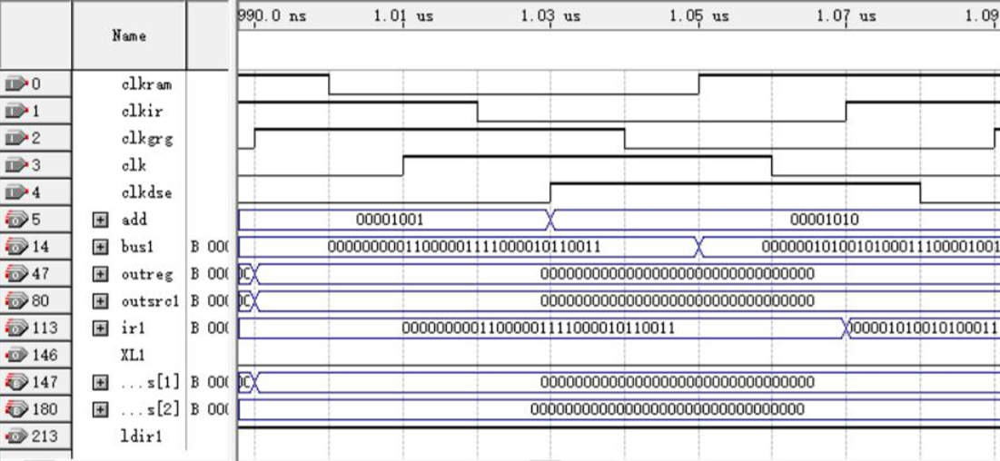
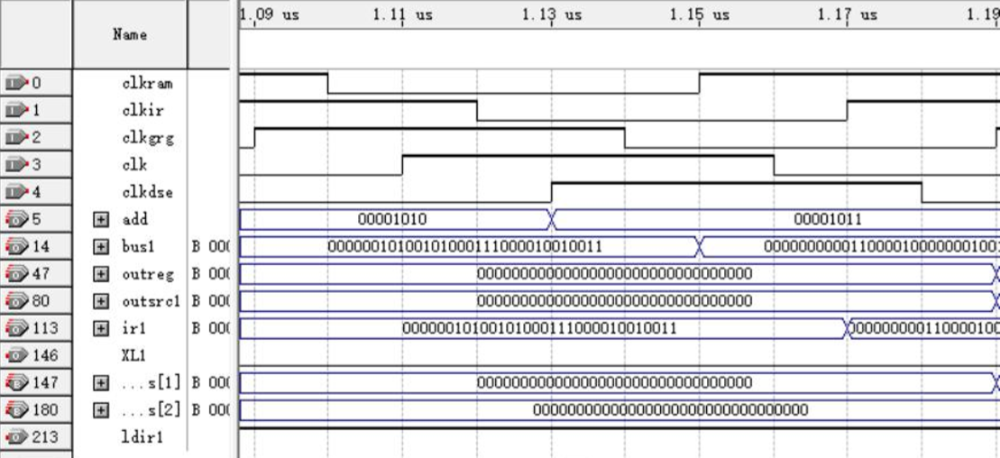
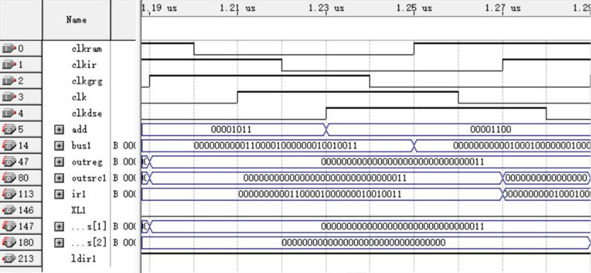

# CPU实验报告

班级：智能1602

学号：201608010624

姓名：牟清华

## 实验目标

实现单周期CPU的设计

## 实验要求

- 硬件设计采用VHDL或Verilog语言，软件设计采用C/C++或SystemC语言，其它语言例如Chisel、MyHDL等也可选
- 实验报告采用markdown语言，或者直接上传PDF文档
- 实验最终提交所有代码和文档

## 实验内容

### RISC-V指令集介绍

**RV32I指令集包含了六种基本指令格式，分别是：**

R类型指令：用于寄存器到寄存器操作

I类型指令：用于短立即数和访存load操作

S类型指令：用于访存store操作

B类型指令：用于条件跳转操作

U类型指令：用于长立即数

J类型指令：用于无条件跳转

**RISC-V指令集编码格式**


**RISC-V指令**


## CPU设计代码

```vhdl
library ieee;
use ieee.std_logic_1164.all;
use ieee.numeric_std.all;
use ieee.std_logic_unsigned.all;
entity mycpu is
	port(
			clk: in std_logic;
			LOAD: in std_logic;
			STORE: in std_logic;
			LUI: in std_logic;
			AUIPC: in std_logic;
			RI: in std_logic;
			RR: in std_logic;
			JAL: in std_logic;
			JALR: in std_logic;
			BE : in std_logic;
			funct3: in std_logic_vector(2 downto 0);
			rs1: in std_logic_vector(4 downto 0);
			rs2: in std_logic_vector(4 downto 0);
			rd: in std_logic_vector(4 downto 0);
			mem: in std_logic_vector(31 downto 0);
			imm: in std_logic_vector(11 downto 0);
			imm1: in std_logic_vector(19 downto 0);
			q: in std_logic_vector(7 downto 0);
			src1: out std_logic_vector(31 downto 0);
			src2: out std_logic_vector(31 downto 0);
			OUTA: out std_logic_vector(31 downto 0);
			wrimem: out std_logic_vector(31 downto 0);
			JUM: out std_logic_vector(7 downto 0);
			JUD: out std_logic
);
end mycpu;

architecture behav of mycpu is
	type regfile is array(31 downto 0) of std_logic_vector(31 downto 0);
	signal regs:regfile;
	signal lo:std_logic:='0';
	signal srcc1:std_logic_vector(31 downto 0);
	signal srcc2:std_logic_vector(31 downto 0);
	signal tem1:bit_vector(31 downto 0);
	signal count:integer range 0 to 31;
	signal count1:integer range 0 to 31;
	begin
	srcc1<= regs(to_integer(unsigned(rs1)));
	src1 <= srcc1;
	OUTA <= regs(1);
	srcc2<= regs(to_integer(unsigned(rs2)));
	src2 <= srcc2;
	tem1 <=to_bitvector(srcc1);
	count<=to_integer(unsigned(imm(4 downto 0)));
	count1 <= to_integer(unsigned(srcc2));
	process(clk)
	variable mem1:std_logic_vector(7 downto 0);
	variable tem:std_logic_vector(31 downto 0);
	variable mem2:std_logic_vector(15 downto 0);
	variable imm2:signed(31 downto 0);
	variable tem2:bit_vector(31 downto 0);
	variable tem3:std_logic_vector(7 downto 0);
	variable tem4:std_logic_vector(32 downto 0);
	variable tem5:std_logic_vector(32 downto 0);
	variable tem6:std_logic_vector(32 downto 0);
	begin
		if(clk'event and clk='1') then
			if(LOAD='1') then
				case lo is
					when '0'=>
						lo<='1';
					when '1'=>
						lo<='0';
				end case;
				if(lo='1') then
					case funct3 is
						when "000"=>--LB
							mem1:=mem(7 downto 0);
							tem:=std_logic_vector(resize(signed(mem1),tem'LENGTH));
							regs(to_integer(unsigned(rd)))<=tem;
						when "001"=>--LH
							mem2:=mem(15 downto 0);
							tem:=std_logic_vector(resize(signed(mem2),tem'LENGTH));
							regs(to_integer(unsigned(rd)))<=tem;
						when "010"=>--LW
							regs(to_integer(unsigned(rd)))<=mem;
						when "100"=>--LBU
							mem1:=mem(7 downto 0);
							regs(to_integer(unsigned(rd)))<="000000000000000000000000"&mem1;
						when "101"=>--LHU
							mem2:=mem(15 downto 0);
							regs(to_integer(unsigned(rd)))<="0000000000000000"&mem2;
						when others=>
					end case;
				end if;
			elsif(STORE='1') then
				case lo is
					when '0'=>
						lo<='1';
					when '1'=>
						lo<='0';
				end case;
				if(lo='0') then
					case funct3 is
						when "000"=>--SB
							mem1:=srcc2(7 downto 0);
							wrimem<="000000000000000000000000"&mem1;
						when "001"=>--SH
							mem2:=srcc2(15 downto 0);
							wrimem<="0000000000000000"&mem2;
						when "010"=>--SW
							wrimem<=srcc2;
						when others=>
							wrimem<=(others=>'Z');
					end case;
				else
					wrimem<=(others=>'Z');
				end if;
			elsif(LUI='1') then--LUI
				regs(to_integer(unsigned(rd)))<=imm1&"000000000000";
			elsif(AUIPC='1') then--AUIPC
				tem:=imm1&"000000000000";
				regs(to_integer(unsigned(rd)))<=imm1&"000000000000";
				JUM<=tem(7 downto 0);
			elsif(RI='1') then
				case funct3 is
					when "000"=>--ADDI
						regs(to_integer(unsigned(rd)))<=(imm+srcc1);
					when "010"=>--SLTI
						imm2:=resize(signed(imm), imm2'length);
					if(signed(srcc1)<imm2) then
						regs(to_integer(unsigned(rd)))<=(others=>'1');
					else
						regs(to_integer(unsigned(rd)))<=(others=>'0');
					end if;
					when "011"=>--SLTIU
						if(srcc1<"00000000000000000000"&imm) then
							regs(to_integer(unsigned(rd)))<=(others=>'1');
						else
							regs(to_integer(unsigned(rd)))<=(others=>'0');
						end if;
					when "100"=>--XORI
						imm2:=resize(signed(imm), imm2'length);
						regs(to_integer(unsigned(rd)))<=(srcc1 xor std_logic_vector(imm2));
					when "110"=>--ORI
						imm2:=resize(signed(imm), imm2'length);
						regs(to_integer(unsigned(rd)))<=(srcc1 or std_logic_vector(imm2));
					when "111"=>--ANDI
						imm2:=resize(signed(imm), imm2'length);
						regs(to_integer(unsigned(rd)))<=(srcc1 and std_logic_vector(imm2));
					when "001"=>--SLLI
						tem2:=tem1 sll count;
						regs(to_integer(unsigned(rd)))<=to_stdlogicvector(tem2);
					when "101"=>
						if(imm(11 downto 5)="0000000") then--SRLI
							tem2:=tem1 srl count;
							regs(to_integer(unsigned(rd)))<=to_stdlogicvector(tem2);
						else--SRAI
							tem2:=tem1 sra count;
							regs(to_integer(unsigned(rd)))<=to_stdlogicvector(tem2);
						end if;
				end case;
			elsif(RR='1') then
				case funct3 is
					when "000"=>
						if(imm(11 downto 5)="0000000") then--ADD
							tem4:=std_logic_vector(resize(signed(srcc1),tem4'LENGTH));
							tem5:=std_logic_vector(resize(signed(srcc2),tem5'LENGTH));
							tem6:=std_logic_vector(signed(tem4)+signed(tem5))(32 downto 0);
							if(tem6(32)='1' and tem6(31)='0') then
								regs(to_integer(unsigned(rd)))<="10000000000000000000000000000000";
							elsif(tem6(32)='0' and tem6(31)='1') then
								regs(to_integer(unsigned(rd)))<="01111111111111111111111111111111";
							else
								regs(to_integer(unsigned(rd)))<=tem6(31 downto 0);
							end if;
						else--SUB
							tem4:=std_logic_vector(resize(signed(srcc1),tem4'LENGTH));
							tem5:=std_logic_vector(resize(signed(srcc2),tem5'LENGTH));
							tem6:=std_logic_vector(signed(tem4)-signed(tem5))(32 downto 0);
							if(tem6(32)='1' and tem6(31)='0') then
								regs(to_integer(unsigned(rd)))<="10000000000000000000000000000000";
							elsif(tem6(32)='0' and tem6(31)='1') then
								regs(to_integer(unsigned(rd)))<="01111111111111111111111111111111";
							else
								regs(to_integer(unsigned(rd)))<=tem6(31 downto 0);
							end if;
						end if;
					when "001"=>--SLL
						tem2:=tem1 sll count1;
						regs(to_integer(unsigned(rd)))<=to_stdlogicvector(tem2);
					when "010"=>--SLT
						if(signed(srcc1)<signed(srcc2)) then
							regs(to_integer(unsigned(rd)))<=(others=>'1');
						else
							regs(to_integer(unsigned(rd)))<=(others=>'0');
						end if;
					when "011"=>--SLTU
						if(srcc1<srcc2) then
							regs(to_integer(unsigned(rd)))<=(others=>'1');
						else
							regs(to_integer(unsigned(rd)))<=(others=>'0');
						end if;
					when "100"=>--XOR
						regs(to_integer(unsigned(rd)))<=(srcc1 xor srcc2);
					when "101"=>
						if(imm(11 downto 5)="0000000") then--SRL
							tem2:=tem1 srl count1;
							regs(to_integer(unsigned(rd)))<=to_stdlogicvector(tem2);
						else--SRA
							tem2:=tem1 sra count1;
							regs(to_integer(unsigned(rd)))<=to_stdlogicvector(tem2);
						end if;
					when "110"=>--OR
						regs(to_integer(unsigned(rd)))<=(srcc1 or srcc2);
					when "111"=>--AND
						regs(to_integer(unsigned(rd)))<=(srcc1 and srcc2);
				end case;
			elsif(JAL='1') then--JAL
				imm2:=resize(signed(imm1), imm2'length);
				tem3:=std_logic_vector(imm2*2)(7 downto 0);
				JUM<=tem3;
				regs(to_integer(unsigned(rd)))<="000000000000000000000000"&tem3;
			elsif(JALR='1') then--JALR
				imm2:=resize(signed(imm), imm2'length);
				tem3:=std_logic_vector(signed(imm2)+signed(srcc1))(7 downto 0);
				JUM<=tem3;
				regs(to_integer(unsigned(rd)))<="000000000000000000000000"&tem3;
			elsif(BE='1') then
				case funct3 is
					when "000"=>--BEQ
						if(srcc1=srcc2) then
							imm2:=resize(signed(imm), imm2'length);
							JUM<=std_logic_vector(imm2*2)(7 downto 0);
							JUD<='1';
						else
							JUD<='0';
						end if;
					when "001"=>--BNE
						if(srcc1/=srcc2) then
							imm2:=resize(signed(imm), imm2'length);
							JUM<=std_logic_vector(imm2*2)(7 downto 0);
							JUD<='1';
						else
							JUD<='0';
						end if;
					when "100"=>--BLT
						if(signed(srcc1)<signed(srcc2)) then
							imm2:=resize(signed(imm), imm2'length);
							JUM<=std_logic_vector(imm2*2)(7 downto 0);
							JUD<='1';
						else
							JUD<='0';
						end if;
					when "101"=>--BGE
						if(signed(srcc1)>signed(srcc2)) then
							imm2:=resize(signed(imm), imm2'length);
							JUM<=std_logic_vector(imm2*2)(7 downto 0);
							JUD<='1';
						else
							JUD<='0';
						end if;
					when "110"=>--BLTU
						if(srcc1<srcc2) then
							imm2:=resize(signed(imm), imm2'length);
							JUD<='1';
						else
							JUD<='0';
						end if;
							when "111"=>--BGEU
						if(srcc1>srcc2) then
							imm2:=resize(signed(imm), imm2'length);
							JUM<=std_logic_vector(imm2*2)(7 downto 0);
							JUD<='1';
						else
							JUD<='0';
						end if;
					when others=>
				end case;
			end if;
	end if;
end process;
end behav;
```

## 测试

### 测试平台

|模块|配置|备注|
|:--:|:--:|:--:|
|CPU|Core i5-6700U||
|操作系统|Windows10 专业版||
|仿真软件|quartus 9.1||


### 测试结果

**ADD**

测试所用的指令为：00000000001000010000000010110011

仿真结果为：


分析：这条指令是将寄存器2的数与自身相加存入寄存器1中，由于寄存器2中未写入数值，相加结果为0，寄存器1显示为0

测试指令：00000000000100010000000010110011

仿真结果：


分析：首先在寄存器1与2中都写入0111111111111111111111111111110，故当寄存器1的值与寄存器2的值相加时，加法溢出。结果显示此时加法已溢出，并摒弃了最高位，该指令正确执行

**ADDI**

测试所用的指令为：00000010000100010000000010010011

仿真结果为：



分析：该指令的意思是将指令的前12位（也就是立即数）与寄存器2中存储的数值相加，所得结果存入寄存器1中。由于寄存器2中未写入数值，故寄存器1中显示的数值为该立即数的数值，该指令正确执行 

**SUB**

测试所用的指令为：01000000001000010000000010110011

仿真结果为：



分析：该指令将寄存器1的值与寄存器2的值相减，所得结果存入寄存器1中。由于两个寄存器中的值均为0，故寄存器1显示的值为0

测试指令：

00000000001100001000000010010011

00000000000100010000000100010011

01000000000100010000000010110011

仿真结果为：


分析：首先给寄存器1赋值3，给寄存器2赋值1，再使用SUB指令使寄存器2的值减寄存器1的值的结果存入寄存器1中，因此减法计算是溢出的，高位为1，所得结果为-2，故该指令正确执行

**LUI**

测试所用的指令为：00011000100000100000000010110111

仿真结果为：



分析：这条指令是将20位立即数移至寄存器1的前20位，而寄存器后12位置0。从结果可知，此时立即数已向前移位12位，后12位置0，该指令正确执行

**XOR**

测试所用的指令为：00000000000100000110000010110011

仿真结果为：


分析：这条指令的意思是将寄存器1中的值与寄存器2的值进行异或运算，所得结果存入寄存器1中。由于寄存器2中未写入值，故异或结果为寄存器1中的值，即LUI指令执行之后的结果，该指令正确执行

**XORI**

测试所用的指令为：00000010000100010100000010010011

仿真结果为：



分析：该指令是将寄存器2与立即数进行异或运算，并将结果存入寄存器1中。由于寄存器2的值为0，故结果为立即数的值，该指令正确执行

**OR**

测试所用的指令为：00000000001100001110000010110011

仿真结果为：



分析：该指令是将寄存器1的值与寄存器3的值进行或运算，所得结果存入寄存器1中。由于寄存器3中的值为0，故显示结果为寄存器1中的值，即XORI指令执行结果，该指令正确执行

**ORI**

测试所用的指令为：00000100000100100110000010010011

仿真结果为：



分析：该指令是将寄存器4中的值与立即数进行OR运算，所得结果存入寄存器1中。由于寄存器4中未写入值，故所得结果为立即数的值，该指令正确执行

**AND**

测试所用的指令为：00000000011000001111000010110011

仿真结果为：



分析：该指令是将寄存器6与寄存器15的值进行AND运算，由于这两个寄存器中未写入数值，故AND结果为0，该指令正确执行

**ANDI**

测试所用的指令为：00000010100101000111000010010011

仿真结果为：



分析：该指令是将寄存器8的值与立即数进行AND运算，所得结果存入寄存器1中。由于寄存器8中值为0，故进行AND运算后所得结果为0，该指令正确执行

**SLL**

测试所用的指令为：

00000000001100001000000010010011

00000000000100010000000100010011

00000000000100010001000010110011

仿真结果为：

寄存器1赋值：



寄存器2赋值：


左移：


分析：这三条指令首先对寄存器1与寄存器2进行赋值，然后在将寄存器2的值左移寄存器1中的值，并将结果存入寄存器1中。寄存器2中的值为1，左移三位之后为8，该指令正确执行

## 结果分析

从测试结果可以看出编写的cpu能够完成指令的工作，达到了实验的目的。

