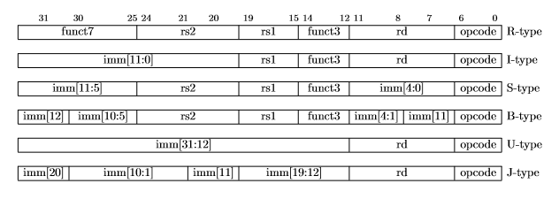
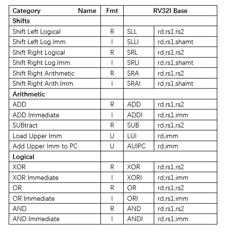
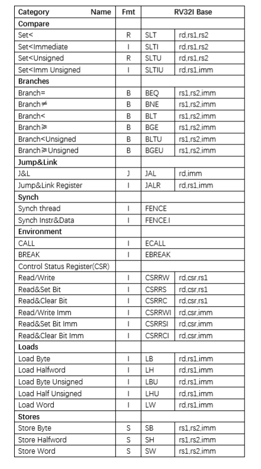

# 模拟器实验报告

班级：智能1602

学号：201608010624

姓名：牟清华

## 实验目标

设计一个能够模拟RV32I指令集的CPU模拟器

## 实验要求

- 使用python编写模拟器代码
- 模拟器的输入是二进制的机器指令文件
- 模拟器的输出是 CPU 各个寄存器的状态和相关的存储器单元状态

## 实验内容

### RISC-V指令集介绍

**RV32I指令集包含了六种基本指令格式，分别是：**

R类型指令：用于寄存器到寄存器操作

I类型指令：用于短立即数和访存load操作

S类型指令：用于访存store操作

B类型指令：用于条件跳转操作

U类型指令：用于长立即数

J类型指令：用于无条件跳转

**RISC-V指令集编码格式**



**RISC-V指令**





## 模拟器设计代码

### 内存分配和管理
```python
def allocMem(s,M):
    M=[0 for i in range(s)]
    MSize=s
    return M,MSize
def freeMem(M):
    del M[:]
```

### 数据的存储和读取
```python
def readByte(M,address):
    if address >= MSize:
        print("ERROR: Address out of range in readByte")
        return 0
    return int('0x'+M[address],16)  #int型
def writeByte(M,address,data):      #data为int型
    data="{0:02x}".format(data)     #data为str型数值为16进制
    if address >= MSize:
        print("ERROR: Address out of range in writeByte")
        return 0
    M[address]=data                 #M[]为str型
def readHalfWord(M,address):
    if address >= MSize-WORDSIZE/2:
        print("ERROR: Address out of range in readHalfWord")
        return 0
    return int('0x'+M[address+1]+M[address],16)
def writeHalfWord(M,address,data):
    data="{0:04x}".format(data)
    if address >= MSize-WORDSIZE/2:
        print("ERROR: Address out of range in writeHalfWord")
        return 0
    M[address+1]=data[0:2]
    M[address]=data[2:4]
def readWord(M,address):
    if address >= MSize:
        print("ERROR: Address out of range in readWord")
        return 0
    return int('0x'+M[address+3]+M[address+2]+M[address+1]+M[address],16)
def writeWord(M,address,data):
    data="{0:08x}".format(data)
    if address >= MSize:
        print("ERROR: Address out of range in writeWord")
        return 0
    M[address+3]=data[0:2]
    M[address+2]=data[2:4]
    M[address+1]=data[4:6]
    M[address]=data[6:8]
```

### 存储器的设计以及指令的初始存储
```python
def Mem(M):
    writeWord(M,0,(0xfffff<<12)|(2<<7)|(opcode['LUI']))
    writeWord(M,4,(1<<12)|(5<<7)|(opcode['AUIPC']))
    writeWord(M,8,(0x20<<25)|(5<<20)|(opcode['SW']))
    writeWord(M,12,(0x400<<20)|(3<<7)|(opcode['LB']))
    writeWord(M,16,(0x400<<20)|(7<<7)|(opcode['LBU']))
    writeWord(M,20,(2<20)|(0x8<<7)|(opcode['BGE']))
    writeWord(M,28,(0x8<<20)|(3<<15)|(8<<7)|(opcode['SLTIU']))
    writeWord(M,32,(0x2<<20)|(0x2<<15)|(9<<7)|(opcode['SRAI']))
    
    writeWord(M,36,(0x400)<<20|(1<<15)|(4<<7)|(opcode['JALR']))
    writeWord(M,40,(0x20<<25)|(7<<20)|(9<<7)|(opcode['SH']))
    writeWord(M,44,(4<<20)|(1<<15)|(0x8<<7)|(opcode['BGEU']))
    writeWord(M,48,(0x400<<20)|(2<<15)|(4<<7)|(opcode['ORI']))
    writeWord(M,52,(4<<20)|(2<<15)|(9<<7)|(opcode['SUB']))
	
    writeWord(M,56,(1<<31)|(8<<20)|(opcode['BLTU']))
    writeWord(M,60,(0x20<<25)|(8<<20)|(opcode['SB']))
    writeWord(M,64,(0x100<<20)|(3<<15)|(9<<7)|(opcode['XORI']))
    writeWord(M,68,(3<<20)|(1<<15)|(10<<7)|(opcode['ADD']))
    writeWord(M,72,(1<<31)|(1<<23)|(1<<22)|(1<<12)|(7<<7)|(opcode['JAL']))
	
    writeWord(M,0,0x0013ab73)
    writeWord(M,4,0x0013db73)
    writeWord(M,8,0x0013fb73)
    writeWord(M,12,0x0000100f)
    writeWord(M,16,0x00100073)
```
### 指令的译码
```python
def decode(instruction,R):		#instruction为int型
    opcd=instruction&0xfe00707f
    rd=(instruction&0x0f80)>>7
    rs1=(instruction&0xf8000)>>15
    zimm=rs1
    rs2=(instruction&0x1f00000)>>20
    shamt=rs2
    imm11_0i=instruction>>20
    csr=instruction>>20
    imm11_5s=instruction>>25
    imm4_0s=(instruction>>7)&0x01f
    imm12b=instruction>>31
    imm10_5b=(instruction>>25)&0x3f
    imm4_1b=(instruction&0x0f00)>>8
    imm11b=(instruction&0x080)>>7
    imm31_12u=instruction>>12
    imm20j=instruction>>31
    imm10_1j=(instruction>>21)&0x3ff
    imm11j=(instruction>>20)&1
    imm19_12j=(instruction>>12)&0x0ff
    pred=(instruction>>24)&0x0f
    succ=(instruction>>20)&0x0f

    src1=R[rs1]
    src2=R[rs2]

    Imm11_0ItypeZeroExtended=imm11_0i& 0x0fff
    Imm11_0ItypeSignExtended=imm11_0i
    Imm11_0StypeSignExtended=(imm11_5s<<5)|imm4_0s
    Imm12_1BtypeZeroExtended=imm12b&0x00001000|(imm11b<<11)|(imm10_5b<<5)|(imm4_1b<<1)
    Imm12_1BtypeSignExtended=imm12b&0xfffff000|(imm11b<<11)|(imm10_5b<<5)|(imm4_1b<<1)
    Imm31_12UtypeZeroFilled=instruction&0xfffff000
    Imm20_1JtypeSignExtended=(imm20j&0xfff00000)|(imm19_12j<<12)|(imm11j<<11)|(imm10_1j<<1)     
    Imm20_1JtypeZeroExtended=(imm20j&0x00100000)|(imm19_12j<<12)|(imm11j<<11)|(imm10_1j<<1)
    return opcd,rd,rs1,zimm,rs2,shamt,imm11_0i,csr,imm11_5s,imm4_0s,imm12b,imm10_5b,imm4_1b,\
           imm11b,imm31_12u,imm20j,imm10_1j,imm11j,imm19_12j,pred,succ,src1,src2,Imm11_0ItypeZeroExtended,\
           Imm11_0ItypeSignExtended,Imm11_0StypeSignExtended,Imm12_1BtypeZeroExtended,Imm12_1BtypeSignExtended,\
           Imm31_12UtypeZeroFilled,Imm20_1JtypeSignExtended,Imm20_1JtypeZeroExtended
```

### 显示存储器的数据
```python
def showRegs(PC,IR,R):
    print("PC="+hex(PC),end=2*"\t")
    print("IR="+hex(IR))
    for i in range(32):
        if i%4!=3:
            print("R["+hex(i)+"]="+hex(R[i]),end="\t")
        else:
            print("R["+hex(i)+"]="+hex(R[i]),end="\n")
```

### cpu的工作过程
```python
def main():
    M=[]
    M,MSize=allocMem(4096,M)
    Mem(M)
    PC=0
    IR=0
    R=[0 for i in range(32)]
    c='y'
    while c!='n':
        print("Registers bofore executing the instruction @0x"+"{0:x}".format(PC))
        showRegs(PC,IR,R)
    
        IR=readWord(M,PC)
        NextPC=PC+WORDSIZE
        opcd,rd,rs1,zimm,rs2,shamt,imm11_0i,csr,imm11_5s,imm4_0s,imm12b,imm10_5b,imm4_1b,\
        imm11b,imm31_12u,imm20j,imm10_1j,imm11j,imm19_12j,pred,succ,src1,src2,Imm11_0ItypeZeroExtended,\
        Imm11_0ItypeSignExtended,Imm11_0StypeSignExtended,Imm12_1BtypeZeroExtended,Imm12_1BtypeSignExtended,\
        Imm31_12UtypeZeroFilled,Imm20_1JtypeSignExtended,Imm20_1JtypeZeroExtended=\
        decode(IR,R)
        if opcd==opcode['LUI']:
            print("DO LUI")
            R[rd]=Imm31_12UtypeZeroFilled
        elif opcd==opcode['AUIPC']:
            print("DO AUIPC")
            print("PC="+hex(PC))
            print("Imm31_12UtypeZeroFilled ="+hex(Imm31_12UtypeZeroFilled))
            R[rd]=PC+Imm31_12UtypeZeroFilled
        elif opcd==opcode['JAL']:
            print("DO JAL")
            R[rd]=PC+4
            NextPC=PC+Imm20_1JtypeSignExtended
        elif opcd==opcode['JALR']:
            print("DO JALR")
            R[rd]=PC+4
            NextPC=R[rs1]+Imm20_1JtypeSignExtended

        #BRANCH
        elif opcd==opcode['BEQ']:
            print("DO BEQ")
            if src1==src2:
                NextPC=PC+Imm12_1BtypeSignExtended
        elif opcd==opcode['BNE']:
            print("DO BNE")
            if src1!=src2:
                NextPC=PC+Imm12_1BtypeSignExtended
        elif opcd==opcode['BLT']:
            print("DO BLT")
            if int(src1)<int(src2):
                NextPC=PC+Imm12_1BtypeSignExtended
        elif opcd==opcode['BGE']:
            print("DO BGE")
            if int(src1)>=int(src2):
                NextPC=PC+Imm12_1BtypeSignExtended
        elif opcd==opcode['BLTU']:
            print("DO BLTU")
            if src1<int(src2):
                NextPC=PC+Imm12_1BtypeSignExtended
        elif opcd==opcode['BGEU']:
            print("DO BGEU")
            if src1>=src2:
                NextPC=PC+Imm12_1BtypeSignExtended
                
        #LOAD
        elif opcd==opcode['LB']:
            print("DO LB")
            print("LB Address is:"+hex(src1+Imm11_0ItypeSignExtended))
            LB_LH=readByte(M,(src1+Imm11_0ItypeSignExtended))
            LB_LH_UP=LB_LH>>7
            if LB_LH_UP==1:
                LB_LH=0xffffff00&LB_LH
            else:
                LB_LH=0x000000ff&LB_LH
            R[rd]=LB_LH
        elif opcd==opcode['LH']:
            print("DO LH")
            temp_LH=readHalfWord(M,(src1+Imm11_0ItypeSignExtended))
            temp_LH_UP=temp_LH>>15
            if temp_LH_UP==1:
                temp_LH=0xffff0000|temp_LH
            else:
                temp_LH=0x0000ffff&temp_LH
            R[rd]=temp_LH
        elif opcd==opcode['LW']:
            print("DO LW")
            temp_LW=readWord(M,(src1+Imm11_0ItypeSignExtended))
            temp_LW_UP=temp_LW>>31
            if temp_LW_UP==1:
                temp_LW=0x00000000|temp_LW
            else:
                temp_LW=0xffffffff&temp_LW
            R[rd]=temp_LW
        elif opcd==opcode['LBU']:
            print("DO LBU")
            R[rd]=readByte(M,(Imm11_0ItypeSignExtended+src1))&0x000000ff
        elif opcd==opcode['LHU']:
            print("DO LHU")
            R[rd]=readHalfWord(M,(Imm11_0ItypeSignExtended+src1))&0x0000ffff

	#STORE
        elif opcd==opcode['SB']:
            print("DO SB")
            sb_dl=R[rs2]&0xff
            sb_al=R[rs1]+Imm11_0StypeSignExtended
            writeByte(M,sb_al,sb_dl)
        elif opcd==opcode['SH']:
            print("DO SH")
            j=R[rs2]&0xffff
            x=R[rs1]+Imm11_0StypeSignExtended
            writeHalfWord(M,x,j)
        elif opcd==opcode['SW']:
            print("DO SW")
            _swData=R[rs2]&0xffffffff
            _swR=R[rs1]+Imm11_0StypeSignExtended
            print("SW Addr and Data are:"+hex(_swR)+","+hex(_swData))
            writeWord(M,_swR, _swData)

        #ALUIMM
        elif opcd==opcode['ADDI']:
            print("DO ADDI")
            R[rd]=src1+Imm11_0ItypeSignExtended
        elif opcd==opcode['SLTI']:
            print("DO SLTI")
            if int(src1)<int(Imm11_0ItypeSignExtended):
                R[rd]=1
            else:
                R[rd]=0
        elif opcd==opcode['SLTIU']:
            print("DO SLTIU")
            if int(src)<Imm11_0ItypeSignExtended:
                R[rd]=1
            else:
                R[rd]=0
        elif opcd==opcode['XORI']:
            print("DO XORI")
            R[rd]=(Imm11_0ItypeSignExtended)^R[rs1]
        elif opcd==opcode['ORI']:
            print("DO ORI")
            R[rd]=R[rs1]|Imm11_0ItypeSignExtended
        elif opcd==opcode['ANDI']:
            print("DO ANDI")
            R[rd]=R[rs1]&Imm11_0ItypeSignExtended
        elif opcd==opcode['SLLI']:
            print("DO SLLI")
            R[rd]=src1<<shamt
        elif opcd==opcode['SRLI']:
            print("DO SRLI")
            R[rd]=src1>>shamt
        elif opcd==opcode['SRAI']:
            R[rd]=int(src1)>>shamt

        #ALU
        elif opcd==opcode['ADD']:
            print("DO ADD")
            R[rd]=R[rs1]+R[rs2]
        elif opcd==opcode['SUB']:
            print("DO SUB")
            R[rd]=R[rs1]-R[rs2]
        elif opcd==opcode['SLL']:
            print("DO SLL")
            rsTransform=R[rs2]&0x1f
            R[rd]=R[rs1]<<rsTransform
        elif opcd==opcode['SLT']:
            print("DO SLT")
            if int(src1)<int(src2):
                R[rd]=1
            else:
                R[rd]=0
        elif opcd==opcode['SLTU']:
            print("DO SLTU")
            if src2!=0:
                R[rd]=1
            else:
                R[rd]=0
        elif opcd==opcode['XOR']:
            print("DO XOR")
            R[rd]=R[rs1]^R[rs2]
        elif opcd==opcode['OR']:
            print("DO OR")
            R[rd]=R[rs1]|R[rs2]
        elif opcd==opcode['AND']:
            print("DO AND")
            R[rd]=R[rs1]&R[rs2]
        elif opcd==opcode['SRL']:
            print("DO SRL")
            R[rd]=R[rs1]>>R[rs2]
        elif opcd==opcode['SRA']:
            print("DO SRA")
            R[rd]=int(src1)>>src2      
            
	#FENCES
        elif opcd==opcode['FENCE']:
            break
        elif opcd==opcode['FENCE_I']:
            print("fence_i,nop")
            			
        # CSRX
        elif opcd==opcode['ECALL']:
            break
        elif opcd==opcode['EBREAK']:
            PC=ebreakadd
            print("do ebreak and pc jumps to:"+str(ebreakadd))
        elif opcd==opcode['CSRRW']:
            break
        elif opcd==opcode['CSRRS']:
            temp=readWord(M,rs2)&0x00000fff
            temp1=rs1&0x000fffff
            writeWord(M,rd,(temp|temp1))
            print("do CSRRS and the result is:"+"rd="+hex(readWord(M,rd)))
        elif opcd==opcode['CSRRWI']:
            if rd==0:
                break
            else:
                zmm=imm11j&0x0000001f
                tem=readWord(M,rs2)&0x00000fff
                writeWord(M,rd,tem)
                writeWord(M,rs2,zmm)
                print("do CSRRWI and the result is:"+"rd="+hex(readWord(M,rd)))
        elif opcd==opcode['CSRRSI']:
            break
        elif opcd==opcode['CSRRCI']:
            zmm=imm11j&0x0000001f
            tem=readWord(M,rs2)&0x00000fff
            if readWord(M,rd)!=0:
                writeWord(M,rs2,zmm|tem)
            print("do CSRRCI and the result is:"+"rd="+hex(readWord(M,rd)))
        else:
            print("ERROR: Unkown instruction "+hex(IR))
        PC=NextPC
        print("Registers after executing the instruction")
        showRegs(PC,IR,R)
        print("Continue simulation (y/n)? [y]")
        c=input()
    freeMem(M)
    return 0
```

## 测试

### 测试平台

|模块|配置|备注|
|:--:|:--:|:--:|
|CPU|Core i5-6700U||
|操作系统|Windows10 专业版||
|运行环境|python 3.6||

### 测试结果

运行程序后的输出的前4条指令如下：
第一条指令：


第二条指令：


第三条指令：


第四条指令：


## 结果分析

从测试结果可以看出编写的模拟器代码确实能够模拟cpu的工作过程，达到了实验的目的。

