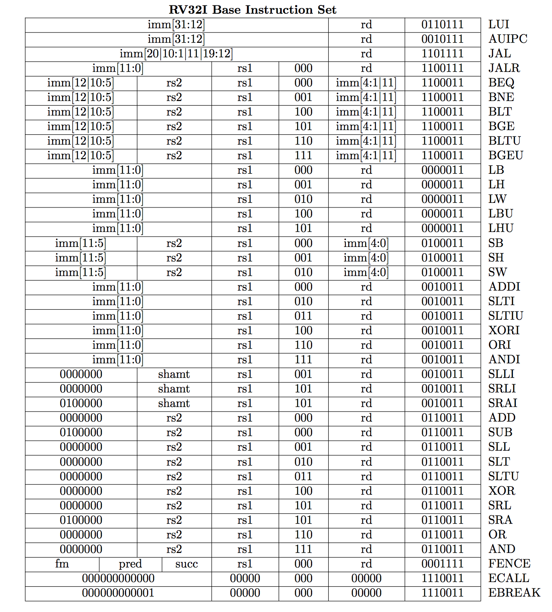

## Instructions encoding
To make it less complicated, we're only talking about single-stage processor below. A single-stage processor is similar to a simulator.

If you look at the base integer instruction set carefully, you'll understand why different types of instruction encodings are needed. 

Since RV32I is a RISC ISA, it is a Load-Store machine, which in turn means no memory access is allowed while an instruction other than a Load or Store instruction is executed.

Roughly, we can classify the base instruction set into four categories:

- The ones accomplished by ALU:
    - at most 2 operands supplied per instruction where
    - both operands are read from registers(**R-type**) or
    - one operand is read from a register, while the other is an immediate(**I-type**).

- The ones that involve memory access: Load(**I-type** and **U-type** for LUI) and Store variances(**S-type**).

- The ones that change the current program counter register:
    - unconditional branches include JAL(**J-type**) and JALR(**I-type**);
    - conditional branches(**B-type**).

- The ones that aren't covered by the above categories:
    - system instructions. E.g. ECALL and EBREAK.
    - U-type AUIPC instruction, which can be regarded as a pure computation.

I've currently captured a clearer picture on the overall design. 